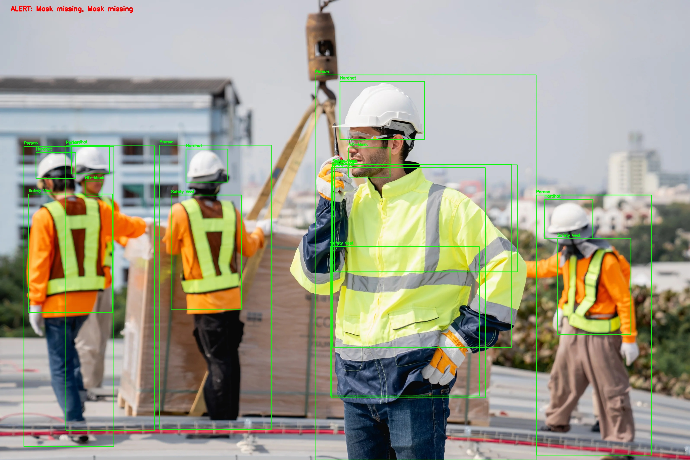
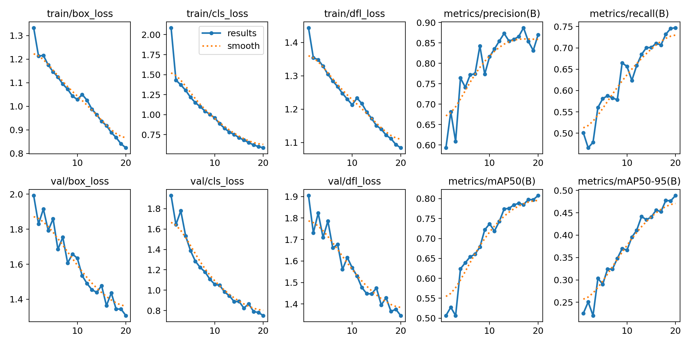
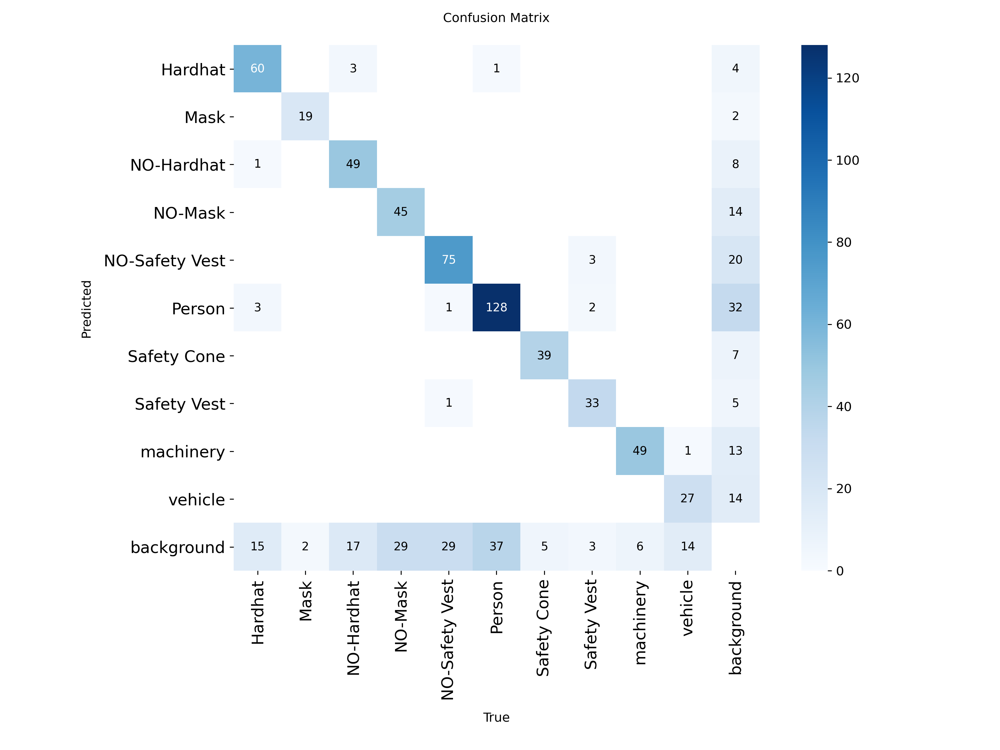
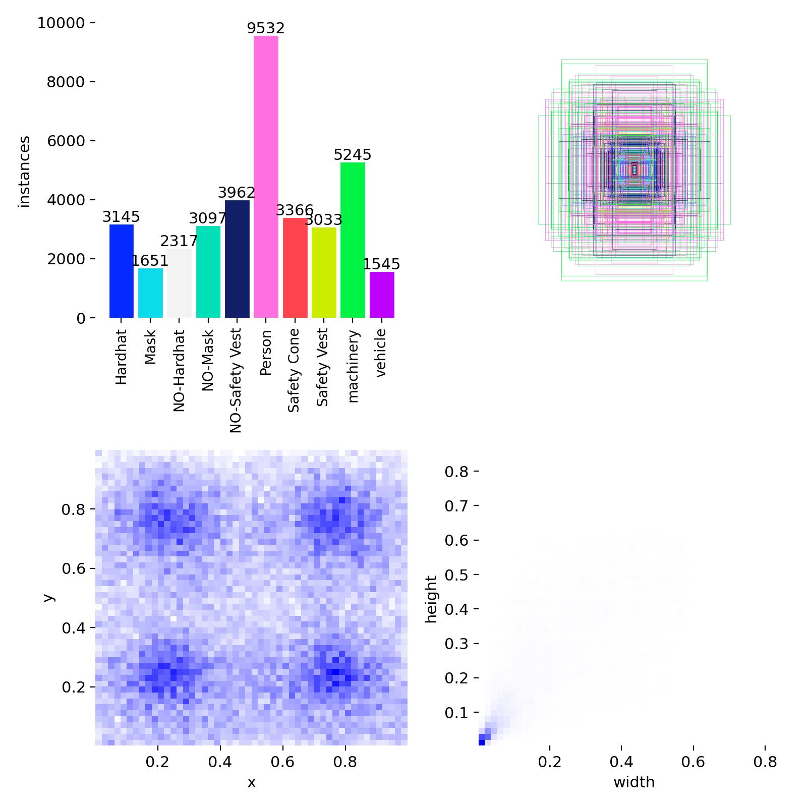

# RiskRadar – AI-Powered PPE Compliance & Workplace Safety Monitoring

## Overview

RiskRadar is a computer vision–based workplace safety monitoring system designed to detect Personal Protective Equipment (PPE) compliance in construction and industrial environments using YOLOv8.

The system analyzes images, videos, and live webcam feeds to identify:

* Workers (Persons)
* Safety Helmets (Hardhats)
* Face Masks
* Safety Vests
* Machinery
* Vehicles
* Safety Cones

RiskRadar automatically detects PPE violations and generates real-time visual alerts to improve workplace safety and monitoring.

---

## Key Features

✅ Real-Time PPE Detection

✅ Helmet Compliance Monitoring

✅ Face Mask Compliance Monitoring

✅ Safety Vest Compliance Monitoring

✅ Image-Based Detection

✅ Video-Based Detection

✅ Live Webcam Monitoring

✅ Automated Violation Detection

✅ Safety Event Logging

✅ Custom YOLOv8 Training Pipeline

✅ Trained on Construction Site Safety Dataset

---

## PPE Violation Detection

RiskRadar identifies the following workplace safety violations:

| Violation           | Trigger                 |
| ------------------- | ----------------------- |
| Helmet Missing      | NO-Hardhat detected     |
| Mask Missing        | NO-Mask detected        |
| Safety Vest Missing | NO-Safety Vest detected |

Detected violations are highlighted directly on the video stream or image with alert messages.

---

## Dataset

This project uses the Construction Site Safety Dataset (Roboflow) available on Kaggle.

### Dataset Classes

| ID | Class          |
| -- | -------------- |
| 0  | Hardhat        |
| 1  | Mask           |
| 2  | NO-Hardhat     |
| 3  | NO-Mask        |
| 4  | NO-Safety Vest |
| 5  | Person         |
| 6  | Safety Cone    |
| 7  | Safety Vest    |
| 8  | Machinery      |
| 9  | Vehicle        |

Dataset Link:

https://www.kaggle.com/datasets/snehilsanyal/construction-site-safety-image-dataset-roboflow

---

## Tech Stack

### Programming Language

* Python

### Deep Learning

* PyTorch
* Ultralytics YOLOv8

### Computer Vision

* OpenCV

### Data Processing

* NumPy
* Pandas

---

## Project Structure

```text
RiskRadar/
│
├── dataset/
│   ├── train/
│   │   ├── images/
│   │   └── labels/
│   │
│   ├── valid/
│   │   ├── images/
│   │   └── labels/
│   │
│   ├── test/
│   │   ├── images/
│   │   └── labels/
│   │
│   └── data.yaml
│
├── weights/
│   └── best.pt
│
├── test_images/
│
├── outputs/
│
├── ppe_rules.py
├── preprocess.py
├── explore_dataset.py
├── train_yolo.py
├── trainwithhp.py
├── test_detections.py
│
├── requirements.txt
├── environment.yml
├── .gitignore
└── README.md
```

---

# Installation

## 1. Clone Repository

```bash
git clone https://github.com/koyya-suchitra/RiskRadar.git
cd RiskRadar
```

---

## 2. Create Virtual Environment

### Windows

```bash
python -m venv venv
venv\Scripts\activate
```

### Linux / macOS

```bash
python3 -m venv venv
source venv/bin/activate
```

---

## 3. Install Dependencies

```bash
pip install -r requirements.txt
```

---

# Dataset Setup

Download the Construction Site Safety Dataset from Kaggle.

Extract the downloaded dataset and place it inside the project directory as:

```text
RiskRadar/
│
└── dataset/
    ├── train/
    ├── valid/
    ├── test/
    └── data.yaml
```

Verify that your `data.yaml` file exists:

```text
dataset/data.yaml
```

Example:

```yaml
path: dataset

train: train/images
val: valid/images
test: test/images

names:
  0: Hardhat
  1: Mask
  2: NO-Hardhat
  3: NO-Mask
  4: NO-Safety Vest
  5: Person
  6: Safety Cone
  7: Safety Vest
  8: machinery
  9: vehicle
```

---

# Training the Model

Open:

```python
train_yolo.py
```

Update the dataset path if required.

Start training:

```bash
python train_yolo.py
```

Training results will be saved in:

```text
runs/detect/
```

After training completes:

```text
runs/detect/ppe_yolov8s/weights/best.pt
```

Copy:

```text
best.pt
```

into:

```text
RiskRadar/weights/
```

---

# Running Image Detection

Place test images inside:

```text
test_images/
```

Example:

```text
test_images/image1.jpg
```

Update:

```python
IMAGE_PATH = BASE_DIR / "test_images" / "image1.jpg"
VIDEO_PATH = None
```

Run:

```bash
python test_detections.py
```

Output image will be saved inside:

```text
outputs/
```

---

# Running Video Detection

Place video inside:

```text
test_videos/video1.mp4
```

Update:

```python
IMAGE_PATH = None
VIDEO_PATH = BASE_DIR / "test_videos" / "video1.mp4"
```

Run:

```bash
python test_detections.py
```

Processed video will be saved in:

```text
outputs/output_ppe.mp4
```

---

# Running Webcam Detection

Update:

```python
IMAGE_PATH = None
VIDEO_PATH = None
```

Run:

```bash
python test_detections.py
```

Press:

```text
Q
```

to stop detection.

---

# Sample Workflow

1. Download PPE Dataset
2. Train YOLOv8 Model
3. Obtain best.pt
4. Place best.pt in weights/
5. Test on Images
6. Test on Videos
7. Test on Live Webcam
8. Detect PPE Violations
9. Generate Safety Alerts

---
# Results

## 1. PPE Detection Output



This image shows RiskRadar detecting workers, safety helmets, masks, safety vests, machinery, and other workplace objects. The system highlights PPE violations such as missing helmets, masks, or safety vests using bounding boxes and alerts.

---

## 2. Training Results



This graph shows the model's performance during training. The increasing precision, recall, and mAP values indicate that the YOLOv8 model learned to detect PPE equipment accurately, while the decreasing loss values show successful training convergence.

---

## 3. Confusion Matrix



The confusion matrix illustrates how well the model distinguishes between different classes. Most predictions appear along the diagonal, indicating that the model correctly identifies PPE equipment and workplace objects with high accuracy.

---

## 4. Dataset Label Distribution



This chart shows the distribution of object annotations in the dataset. It provides an overview of how frequently each class appears, helping to understand the dataset composition used for training the model.

# Future Enhancements

* Email Alerts
* SMS Notifications
* Dashboard Analytics
* Occupancy Monitoring
* Multi-Camera Support
* Cloud Deployment
* PPE Compliance Reports
* Real-Time Safety Statistics

---

# Author

### Suchitra Koyya

Final Year B.Tech – Computer Science & Engineering (Data Science)

AI/ML Enthusiast | Computer Vision Developer | Data Science Student

Focused on building intelligent systems for workplace safety, industrial automation, computer vision, and real-world AI applications.

---

## License

This project is intended for educational, research, and workplace safety monitoring purposes.
